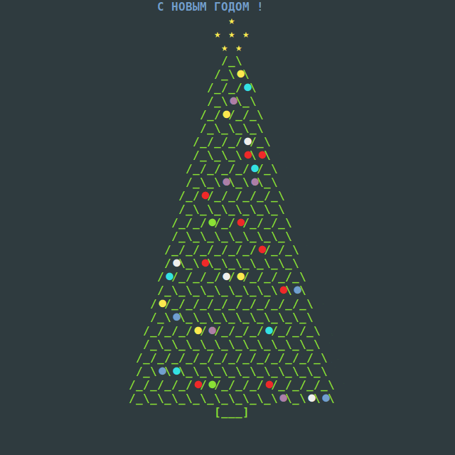

## Go Christmas Tree

A simple Christmas tree made with Golang to play in the terminal.

The tree is resized to fit the size of the terminal. 

## License

MIT, see [LICENSE] (LICENSE)

## Idea

F. L. S. Bustamante, * terminal-christmas-tree *, 2020 - Available at: https://github.com/chicolucio/terminal-christmas-tree
